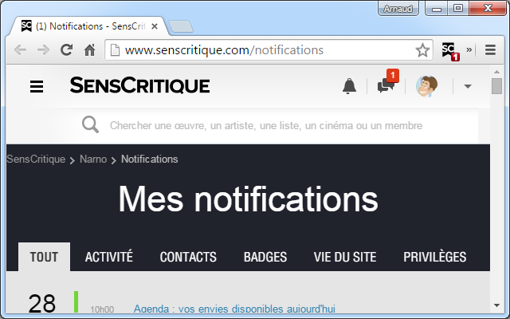

# SensCritique-Notifier

> SensCritique-Notifier is a browser extension that displays your [SensCritique](https://www.senscritique.com) notifications unread count.

  

## Support

<https://github.com/ArnaudLigny/SensCritique-Notifier/issues>

## Source

<https://github.com/ArnaudLigny/SensCritique-Notifier.git>

## License

_SensCritique-Notifier_ is a free software distributed under the terms of the [MIT license](https://opensource.org/licenses/MIT).

© [Arnaud Ligny](https://arnaudligny.fr)  
